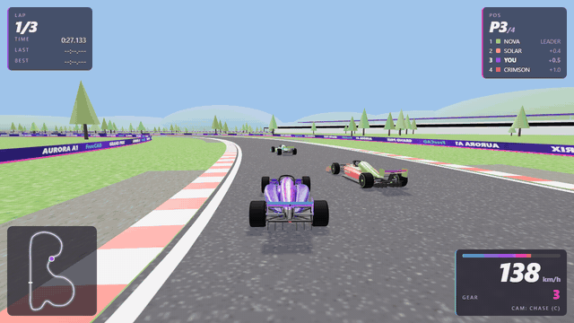
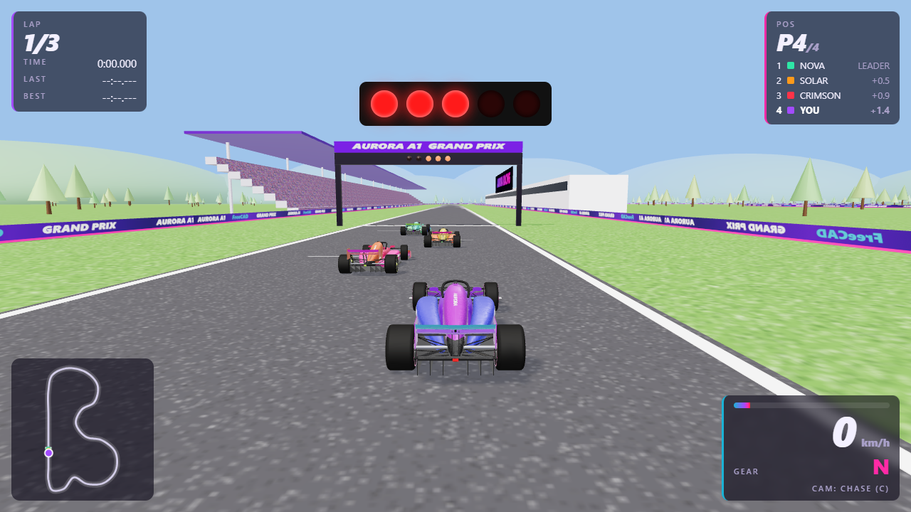
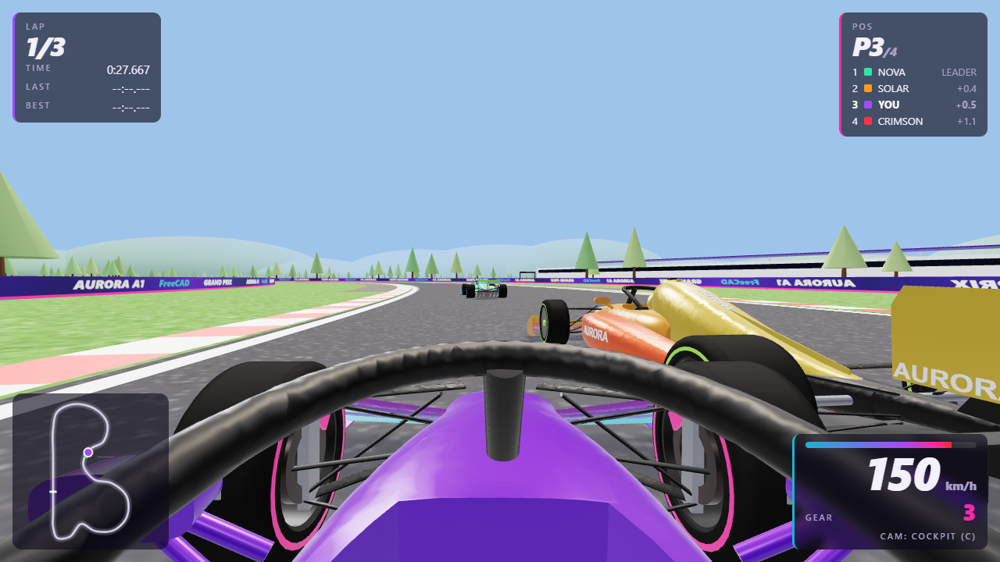
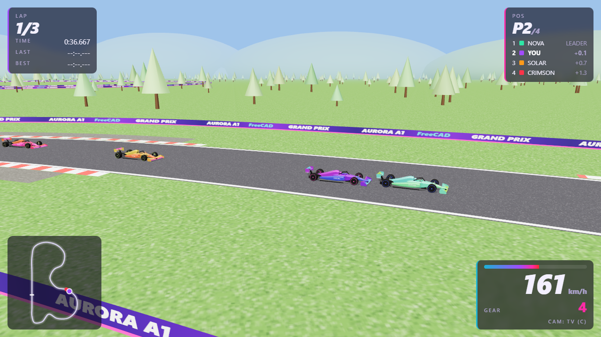
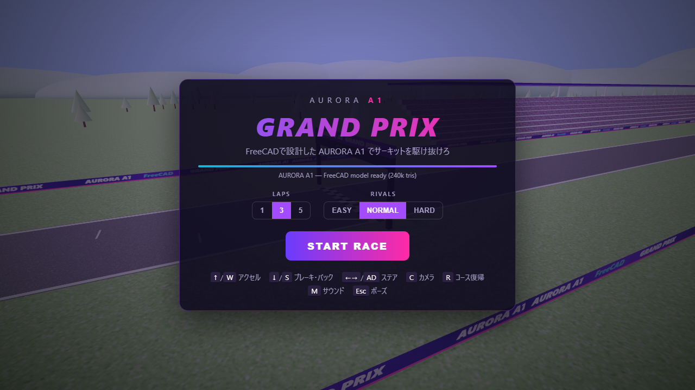
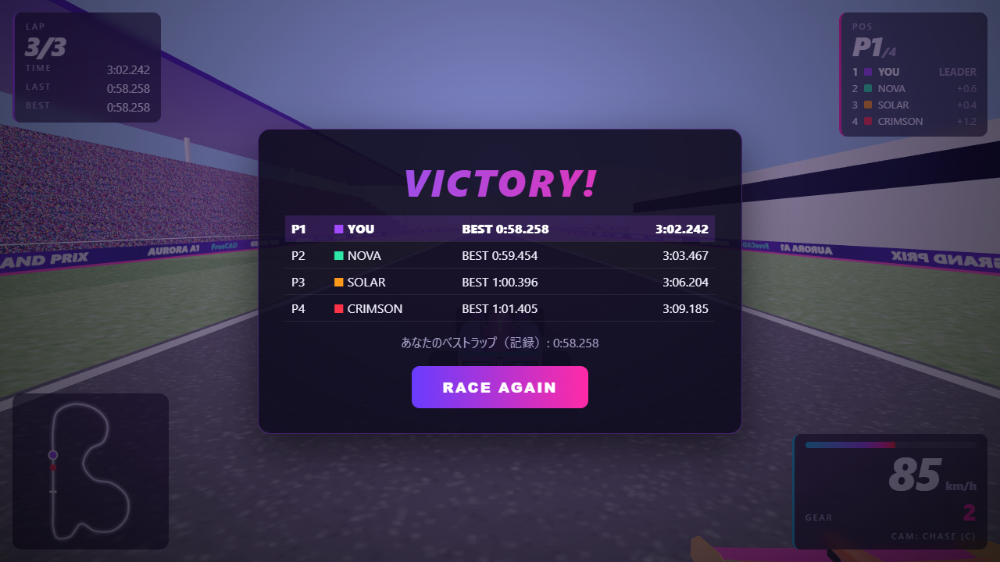
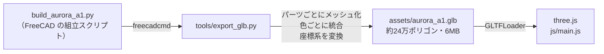
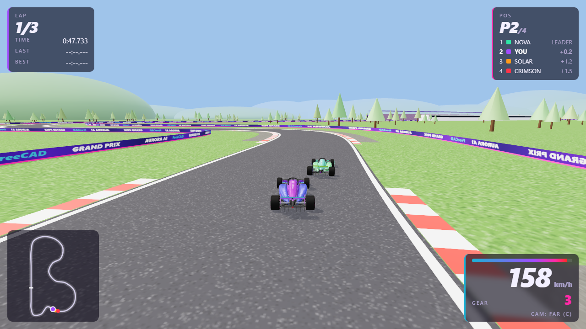

<div align="center">

# AURORA A1 Grand Prix

### FreeCAD で設計した F1 マシンを、そのままブラウザで走らせるレースゲーム



[](https://sunwood-ai-labs.github.io/aurora-a1-grand-prix/)

[](https://threejs.org/)
[](https://github.com/Sunwood-ai-labs/aurora-a1-freecad)
[-6a3cff)](#-ローカルで遊ぶ)

**▶ https://sunwood-ai-labs.github.io/aurora-a1-grand-prix/**

</div>

---

## 🏎️ どんなゲーム？

AIエージェントが FreeCAD で設計した F1 コンセプトカー **AURORA A1**（[CAD リポジトリ](https://github.com/Sunwood-ai-labs/aurora-a1-freecad)）に乗って、3台のライバルと 2.9 km のサーキットでレースします。
車の形状、パーツの色、ロゴ（AURORA / 77）は、すべて CAD のビルドスクリプトから書き出したものです。

<table>
<tr>
<td width="50%"><br><sub><b>5 灯のスタートシグナル</b>：全灯のあと、ランダムな間を置いて消灯したらスタート</sub></td>
<td width="50%"><br><sub><b>ライバルとバトル</b>：AI は走行ラインを取り、前の車を避けて抜きにくる</sub></td>
</tr>
<tr>
<td><br><sub><b>コックピット視点</b>：CAD で作った Halo とステアリング越しの景色</sub></td>
<td><br><sub><b>中継カメラ</b>：コース脇から望遠で追いかける</sub></td>
</tr>
<tr>
<td><br><sub><b>タイトル画面</b>：周回数（1 / 3 / 5）とライバルの強さ（3段階）を選択</sub></td>
<td><br><sub><b>リザルト</b>：順位・ベストラップ。自己ベストはブラウザに保存</sub></td>
</tr>
</table>

### 特徴

- **FreeCAD の CAD モデルそのまま**：約24万ポリゴン。前輪はステアリングに合わせて切れ、車体は加減速とコーナリングで沈み込みます。
- **F1 らしい走り**：ダウンフォース（速度の2乗で増える横グリップ）、速度に応じたステアリング、アンダーステア、芝生での減速、バリアとの衝突。
- **AI ライバル 3台**：コースの曲率から計算した速度プロファイルで走り、前の車がいればラインを変えて抜きにきます。
- **HUD**：速度・ギア（8速）・回転数、順位表とタイム差、ミニマップ、ラップタイム。
- **4つのカメラ**：後方追従 / 遠め / コックピット / 中継カメラ。
- **サウンドは全部合成**：エンジン音、タイヤのスキール音、衝突音、スタート音を WebAudio で生成（音声ファイルなし）。
- **スマホ対応**：タッチ端末では画面上に操作ボタンが出ます。

## 🎮 操作

| キー | 動作 |
| --- | --- |
| <kbd>↑</kbd> / <kbd>W</kbd> | アクセル |
| <kbd>↓</kbd> / <kbd>S</kbd> | ブレーキ（止まった状態で押し続けるとバック） |
| <kbd>←</kbd> <kbd>→</kbd> / <kbd>A</kbd> <kbd>D</kbd> | ハンドル |
| <kbd>C</kbd> | カメラ切り替え |
| <kbd>R</kbd> | コースに戻る |
| <kbd>M</kbd> | サウンド オン / オフ |
| <kbd>Esc</kbd> / <kbd>P</kbd> | ポーズ |

---

## 🔧 CAD モデルがゲームになるまで



<table>
<tr>
<td width="50%"><br><sub>FreeCAD でのレンダー</sub></td>
<td width="50%"><br><sub>ゲーム内（three.js）</sub></td>
</tr>
</table>

[`tools/export_glb.py`](tools/export_glb.py) の処理は次のとおりです。

1. CAD のビルドスクリプト（`build_chassis()`・`build_aero()` など）を FreeCAD のヘッドレス環境で直接呼び、各パーツの形状と色を取得します。
2. 面ごとにメッシュ化します（線形 2 mm・角度 0.35 rad）。全パーツを細かく割ると 180万ポリゴン・50MB になったので、ゲーム用に粗くしています。
3. 同じ色のパーツを1つのメッシュにまとめ、FreeCAD の色を PBR マテリアル（sRGB → リニア変換、カーボンやタイヤは粗め）にします。
4. 4本のホイールは別ノード（`Hub_XX` → `Wheel_XX` + `Caliper_XX`）にします。ゲーム側でホイールを回転させ、前輪は操舵させつつ、キャリパーは回さないためです。
5. 座標系を変換します：FreeCAD（X＝後方・Z＝上・mm）→ three.js（+Z＝前方・Y＝上・m）。

CAD を修正したら、次のコマンドで車を更新できます。

```
freecadcmd tools/export_glb.py
```

> 読み込み元は `C:\Prj\FreeCAD_Demo_001\aurora_a1` に固定しています。別の場所で使う場合は、スクリプト冒頭の `SRC` を書き換えてください。

---

## 💻 ローカルで遊ぶ

ビルド不要の静的サイトです。GLB を読み込むため、HTTP サーバー経由で開いてください。

```bash
python -m http.server 8765
```

→ <http://localhost:8765/> を開きます。Windows なら [`start_game.bat`](start_game.bat) をダブルクリックするだけで起動します。

## 📁 構成

```
index.html / style.css   HUD とメニュー
js/main.js               ゲームループ、車の物理、AI、カメラ、HUD
js/track.js              コース生成（スプライン）：路面・縁石・バリア・スタートゲート・景色
js/audio.js              エンジン音などの合成（WebAudio）
assets/aurora_a1.glb     FreeCAD から書き出した車のモデル
tools/export_glb.py      FreeCAD → GLB エクスポーター
docs/images/             README 用のスクリーンショット
```

## 🧪 デバッグ

ブラウザのコンソールから `__aurora` を操作できます。README のスクリーンショットもこれを使い、ヘッドレス Chrome で撮影しました。

```js
__aurora.auto(true)      // 自動運転
__aurora.run(10)         // シミュレーションを 10 秒進める
__aurora.cam(2)          // カメラ切り替え（0: 追従, 1: 遠め, 2: コックピット, 3: 中継）
__aurora.info()          // 速度・順位・ラップなど
```

## 🔗 関連

- **CAD モデル**：[Sunwood-ai-labs/aurora-a1-freecad](https://github.com/Sunwood-ai-labs/aurora-a1-freecad)（3Dモデル・図面11枚・メイキング動画）
