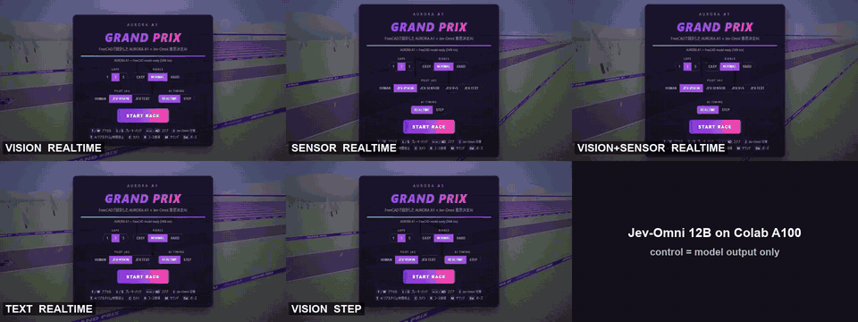
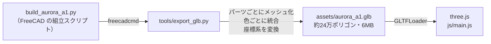

<div align="center">

# AURORA A1 Grand Prix

### FreeCAD で設計した F1 マシンを、そのままブラウザで走らせるレースゲーム


[](https://sunwood-ai-labs.github.io/aurora-a1-grand-prix/)

[](https://threejs.org/)
[](https://github.com/Sunwood-ai-labs/aurora-a1-freecad)
[-6a3cff)](#-ローカルで遊ぶ)

**▶ https://sunwood-ai-labs.github.io/aurora-a1-grand-prix/**

</div>

---

## 🏎️ どんなゲーム？

AIエージェントが FreeCAD で設計した F1 コンセプトカー **AURORA A1**（[CAD リポジトリ](https://github.com/Sunwood-ai-labs/aurora-a1-freecad)）に乗って、3台のライバルと 2.9 km のサーキットでレースします。
車の形状、パーツの色、ロゴ（AURORA / 77）は、すべて CAD のビルドスクリプトから書き出したものです。

<table>
<tr>
<td width="50%"><br><sub><b>5 灯のスタートシグナル</b>：全灯のあと、ランダムな間を置いて消灯したらスタート</sub></td>
<td width="50%"><br><sub><b>ライバルとバトル</b>：AI は走行ラインを取り、前の車を避けて抜きにくる</sub></td>
</tr>
<tr>
<td><br><sub><b>コックピット視点</b>：CAD で作った Halo とステアリング越しの景色</sub></td>
<td><br><sub><b>中継カメラ</b>：コース脇から望遠で追いかける</sub></td>
</tr>
<tr>
<td><br><sub><b>タイトル画面</b>：周回数（1 / 3 / 5）とライバルの強さ（3段階）を選択</sub></td>
<td><br><sub><b>リザルト</b>：順位・ベストラップ。自己ベストはブラウザに保存</sub></td>
</tr>
</table>

### 特徴

- **FreeCAD の CAD モデルそのまま**：約24万ポリゴン。前輪はステアリングに合わせて切れ、車体は加減速とコーナリングで沈み込みます。
- **F1 らしい走り**：ダウンフォース（速度の2乗で増える横グリップ）、速度に応じたステアリング、アンダーステア、芝生での減速、バリアとの衝突。
- **AI ライバル 3台**：コースの曲率から計算した速度プロファイルで走り、前の車がいればラインを変えて抜きにきます。
- **HUD**：速度・ギア（8速）・回転数、順位表とタイム差、ミニマップ、ラップタイム。
- **4つのカメラ**：後方追従 / 遠め / コックピット / 中継カメラ。
- **サウンドは全部合成**：エンジン音、タイヤのスキール音、衝突音、スタート音を WebAudio で生成（音声ファイルなし）。
- **スマホ対応**：タッチ端末では画面上に操作ボタンが出ます。

## 🎮 操作

| キー | 動作 |
| --- | --- |
| <kbd>↑</kbd> / <kbd>W</kbd> | アクセル |
| <kbd>↓</kbd> / <kbd>S</kbd> | ブレーキ（止まった状態で押し続けるとバック） |
| <kbd>←</kbd> <kbd>→</kbd> / <kbd>A</kbd> <kbd>D</kbd> | ハンドル |
| <kbd>J</kbd> | **Jev-Omni AI パイロット切替**（`MANUAL` → `VISION` → `SENSOR` → `V+S` → `TEXT`） |
| <kbd>T</kbd> | Jev-Omni のタイミング切替（`REALTIME` ⇄ `STEP`＝判断を待つ間は時間停止） |
| <kbd>C</kbd> | カメラ切り替え |
| <kbd>R</kbd> | コースに戻る |
| <kbd>M</kbd> | サウンド オン / オフ |
| <kbd>Esc</kbd> / <kbd>P</kbd> | ポーズ |

---

## 🧠 Jev-Omni AI パイロットモード（実験）

オープンウェイトのマルチモーダル意思決定分類器 **[`akhilaaa3/Jev-Omni`](https://huggingface.co/akhilaaa3/Jev-Omni)**（Gemma 4 12B-IT ベース）に車を運転させるモードです。Jev-Omni は文章を生成せず、1 回の Forward Pass で選択肢ごとの確率を返します。ゲームはその確率だけでハンドル・アクセル・ブレーキを決めます。

| 設定 | 内容 |
| --- | --- |
| **JEV-VISION**（デフォルト） | 3D 画面のキャプチャ（512×288 JPEG。HUD は含まない）と、メーターに出ている速度・ギアだけを入力。コースの座標や曲率は渡さない |
| **JEV-SENSOR** | 距離センサーの値だけ（画像なし）。車から 7 方向（左 60°・30°・10°、正面、右 10°・30°・60°）に光線を出し、舗装路の端までの距離を測る LiDAR 風のセンサーと、左右のコース端までの距離。走行ラインや目標速度は含まない |
| **JEV-V+S**（VISION+SENSOR） | 画面キャプチャ＋距離センサーの値 |
| **JEV-TEXT** | ゲームが計算したコース情報（安全速度、走行ラインの方向、次のカーブ、路面）を文章で入力 |
| **REALTIME**（デフォルト） | ゲームの時間は止めない。推論が返るまで車は直前の判断のまま走り続ける |
| **STEP** | 判断が返るまでゲームの時間を止め、1 回の判断ごとに 0.2 秒だけ進める |

- 操作は Jev-Omni の確率から直接計算します：ステア = Σ確率×(左 −1 / 右 +1)、アクセル／ブレーキ = Σ確率×(アクセル +1 / ブレーキ −1)。走行ラインへの補正や速度プロファイルの補助はありません。停止中のブレーキはバックになるため、AI のブレーキは前進中のみ効きます。
- Jev-Omni モードでも車の性能は人間と同じです。
- ブリッジ（`tools/jev_bridge.py`）がモデルにつながっていないとき（GitHub Pages など）は、ゲーム内のルールで走ります。このとき HUD には `LOCAL FALLBACK (no model)` と表示されます。

### 結果：Jev-Omni はこのゲームを運転できませんでした

Google Colab A100 上の Jev-Omni で 1 周レースを録画しました（Colab CLI の永続接続で推論 約 110 ms、画像付き往復で 1.5〜4 Hz）。

| 実行 | 結果 | 動画 |
| --- | --- | --- |
| VISION・REALTIME | スタート直後にアクセルと「ブレーキ＋左」を繰り返し、左のバリアに当たって停止（走行 6 m） | [MP4](docs/videos/jev_vision_realtime.mp4) / [GIF](docs/images/jev_vision_realtime.gif) |
| VISION・STEP | 同じ迷い方。ゲーム時間 3.7 秒でグリッド付近から動けず | [MP4](docs/videos/jev_vision_step.mp4) / [GIF](docs/images/jev_vision_step.gif) |
| SENSOR・REALTIME | 1 コーナー手前で右のバリアに当たり、「アクセル＋左」（74.5%）を選び続けたまま動けず（走行 64 m） | [MP4](docs/videos/jev_sensor_realtime.mp4) / [GIF](docs/images/jev_sensor_realtime.gif) |
| VISION+SENSOR・REALTIME | 画像付きで判断が遅く（0.5 Hz）、「アクセル＋左」寄りのままコース外で停止（走行 46 m） | [MP4](docs/videos/jev_fusion_realtime.mp4) / [GIF](docs/images/jev_fusion_realtime.gif) |
| TEXT・REALTIME | コース情報を文章で渡しても 1 コーナー手前でコース外へ出て、`HARD_BRAKE` を選び続けて停止（走行 196 m） | [MP4](docs/videos/jev_text_realtime.mp4) / [GIF](docs/images/jev_text_realtime.gif) |

<div align="center">

<br><sub>5 つの実行を並べたもの（2 倍速）。<a href="docs/videos/jev_compare.mp4">MP4（等速）</a></sub>
</div>

**なぜ画面から運転できないのか**：走行中のコックピット画面 62 枚（左カーブ 12・直線 25・右カーブ 25。正解はコース形状から計算し、採点だけに使用）で、Jev-Omni が道の向きを当てられるかを測りました（[`tools/eval_jev_prompts.py`](tools/eval_jev_prompts.py)）。

| 質問と選択肢 | 正解率 | 左 / 直線 / 右 |
| --- | --- | --- |
| ゲームで使っている 6 択 | 21% | 7/12・6/25・0/25 |
| 「どちらにハンドルを切る？」3 択 | 44% | 7/12・10/25・10/25 |
| 「道はどちらに曲がっている？」3 択 | 19% | 12/12・0/25・0/25（常に 1 番目の「左」） |
| 同じ質問で選択肢の順番を逆にしたもの | 40% | 0/12・0/25・25/25（常に 1 番目の「右」） |
| 3 通りの順番で確率を平均 | 39〜55% | 55% の方もほぼ常に「右」（常に「右」と答えるだけで 40%） |

Jev-Omni は **選択肢の 1 番目を選ぶ傾向が強く**、このゲームの画面では道の向きをほとんど見分けられていません。順番を入れ替えて平均しても、偶然（33%）を大きく上回る結果にはなりませんでした。

**距離センサーを足した場合**（センサー値付きで別に集めた 51 枚：左 9・直線 25・右 17。ゲームと同じ 6 択）：

| 入力 | 正解率 | 左 / 直線 / 右 |
| --- | --- | --- |
| VISION（画面のみ） | 29% | 9/9・5/25・1/17 |
| SENSOR（センサーのみ） | **57%** | 5/9・9/25・**15/17** |
| VISION+SENSOR | 27% | 8/9・6/25・0/17 |

センサーの値だけを渡すと左右をかなり見分けられるようになりますが、画像も一緒に渡すと答えは画像側（ほぼ「左」）に引っ張られ、センサーの値は使われませんでした。実際の走行でも、SENSOR は 1 コーナー手前でバリアに当たり、止まったあとは同じ判断を繰り返すだけでした。

> 以前のバージョン（コミット `ca99b48`・`adab4f4`）の「P1 で優勝」という結果は、Jev-Omni の出力を内蔵 AI の走行ライン追従に小さく足していただけで、さらに Jev モードだけ車の性能（グリップ 1.22 倍・加速 1.25 倍・空気抵抗 0.62 倍）が上がっていました。そのため Jev-Omni の実力を示すものではなく、現在のバージョンでは補助と性能差を取り除いています。

### 自分で走らせる

[](https://colab.research.google.com/github/Sunwood-ai-labs/aurora-a1-grand-prix/blob/main/notebooks/Jev_Omni_A100_Colab.ipynb)

- **Colab ノートブック**：[`notebooks/Jev_Omni_A100_Colab.ipynb`](notebooks/Jev_Omni_A100_Colab.ipynb) がこのリポジトリをクローンし、A100 に Jev-Omni をロードして、同じプロセス内のブリッジでゲームを表示します。
- **ローカル PC から Google Colab CLI 経由**：

```bash
# 1. A100 セッションを作り、Jev-Omni をロード（約 100 秒・VRAM 約 24 GB）
wsl bash -c '~/.local/bin/colab new --gpu A100 -s jev-racer'
wsl bash -c '~/.local/bin/colab exec -s jev-racer --timeout 900 -f /mnt/c/Prj/Aurora_A1_Racer/tools/colab_init_jev.py'

# 2a. ブラウザで遊ぶ：ブリッジを起動して http://localhost:8765/ を開く
python tools/jev_bridge.py --port 8765 --colab-session jev-racer

# 2b. 自動で 1 周走らせて MP4 / GIF / 判断ログを保存（--timing step で時間停止モード）
python tools/run_jev_race.py --colab-session jev-racer --mode vision --timing realtime   # --mode sensor / fusion / text

# 3. 使い終わったら必ず止める（止めないと compute unit が減り続けます）
wsl bash -c '~/.local/bin/colab stop -s jev-racer'
```

---

## 🔧 CAD モデルがゲームになるまで



<table>
<tr>
<td width="50%"><br><sub>FreeCAD でのレンダー</sub></td>
<td width="50%"><br><sub>ゲーム内（three.js）</sub></td>
</tr>
</table>

[`tools/export_glb.py`](tools/export_glb.py) の処理は次のとおりです。

1. CAD のビルドスクリプト（`build_chassis()`・`build_aero()` など）を FreeCAD のヘッドレス環境で直接呼び、各パーツの形状と色を取得します。
2. 面ごとにメッシュ化します（線形 2 mm・角度 0.35 rad）。全パーツを細かく割ると 180万ポリゴン・50MB になったので、ゲーム用に粗くしています。
3. 同じ色のパーツを1つのメッシュにまとめ、FreeCAD の色を PBR マテリアル（sRGB → リニア変換、カーボンやタイヤは粗め）にします。
4. 4本のホイールは別ノード（`Hub_XX` → `Wheel_XX` + `Caliper_XX`）にします。ゲーム側でホイールを回転させ、前輪は操舵させつつ、キャリパーは回さないためです。
5. 座標系を変換します：FreeCAD（X＝後方・Z＝上・mm）→ three.js（+Z＝前方・Y＝上・m）。

CAD を修正したら、次のコマンドで車を更新できます。

```
freecadcmd tools/export_glb.py
```

> 読み込み元は `C:\Prj\FreeCAD_Demo_001\aurora_a1` に固定しています。別の場所で使う場合は、スクリプト冒頭の `SRC` を書き換えてください。

---

## 💻 ローカルで遊ぶ

[`start_game.bat`](start_game.bat) をダブルクリックするか、以下を実行すると Jev-Omni ブリッジ付きの HTTP サーバーが起動します。

```bash
python tools/jev_bridge.py --port 8765
```

→ <http://localhost:8765/> を開きます。

## 📁 構成

```
index.html / style.css       HUD（Jev-Omni テレメトリパネル含む）とメニュー
js/main.js                   ゲームループ、車の物理、Jev-Omni AI パイロット、カメラ、HUD
js/track.js                  コース生成（スプライン）：路面・縁石・バリア・スタートゲート・景色
js/audio.js                  エンジン音などの合成（WebAudio）
assets/aurora_a1.glb         FreeCAD から書き出した車のモデル
tools/jev_bridge.py          Jev-Omni ローカル HTTP ブリッジ（Google Colab CLI A100 対応）
tools/colab_init_jev.py      Colab A100 セッション上に Jev-Omni をロードする初期化スクリプト
tools/run_jev_race.py        ヘッドレス Chrome で Jev-Omni に 1 周走らせ、MP4 / GIF / 判断ログを保存
tools/colab_worker.py        Colab セッションへの永続接続（ブリッジから起動）
tools/collect_jev_eval.py    画面キャプチャと正解ラベル（評価用）の収集
tools/eval_jev_prompts.py    Jev-Omni が画面から道の向きを読めるかの評価
tools/export_glb.py          FreeCAD → GLB エクスポーター
docs/images/                 スクリーンショット・Jev-Omni 走行 GIF
docs/videos/                 Jev-Omni 走行 MP4
docs/jev_race_*.json         各走行の判断ログと集計（Colab A100 の実推論）
```

## 🧪 デバッグ

ブラウザのコンソールから `__aurora` を操作できます。README のスクリーンショットもこれを使い、ヘッドレス Chrome で撮影しました。

```js
__aurora.jev('vision')   // Jev-Omni AI パイロット切り替え ('off' | 'vision' | 'sensor' | 'fusion' | 'text')
__aurora.timing('step')  // 'realtime' | 'step'
__aurora.jevLog()        // Jev-Omni の判断ログ
__aurora.probe()         // 評価用：モデルに渡す画像と、コース形状から計算した正解
__aurora.run(10)         // シミュレーションを 10 秒進める
__aurora.cam(2)          // カメラ切り替え（0: 追従, 1: 遠め, 2: コックピット, 3: 中継）
__aurora.info()          // 速度・順位・ラップ・Jev-Omni 推論結果など
```

## 🔗 関連

- **CAD モデル**：[Sunwood-ai-labs/aurora-a1-freecad](https://github.com/Sunwood-ai-labs/aurora-a1-freecad)（3Dモデル・図面11枚・メイキング動画）
- **Jev-Omni モデル**：[akhilaaa3/Jev-Omni](https://huggingface.co/akhilaaa3/Jev-Omni)

